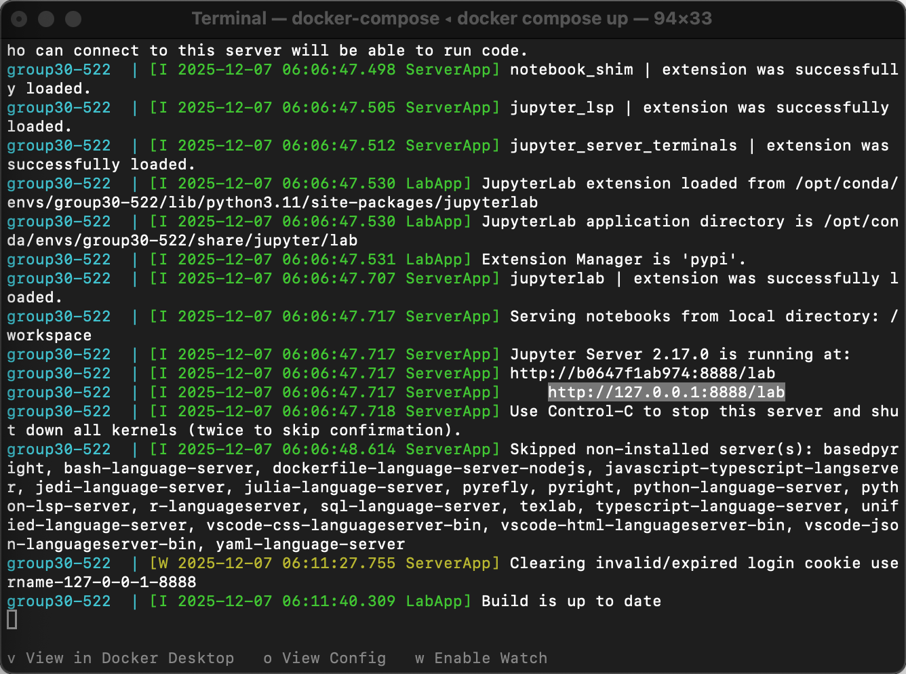

# Predicting Abalone Ages Based on Individual Characteristics - Regression Problem

## Project Summary

This project builds and compares regression models to predict the age of individual abalones from simple physical measurements. Using the Abalone dataset from the UCI Machine Learning Repository, we model the relationship between age (approximated from shell rings) and features such as sex, shell length, diameter, height, and several weight measurements.

We fit three supervised learning models in Python:

- **Baseline linear regression**
- **Random Forest regressor**
- **Support Vector Regressor (SVR) with an RBF kernel**

Our linear regression model explains about half of the variance in ring count (R² ≈ 0.44, RMSE ≈ 5.48), while the non-linear Random Forest and SVR models both perform better (R² ≈ 0.52, RMSE ≈ 4.76–4.70). Whole weight is a strong positive predictor of age, whereas shucked weight has a strong negative coefficient, suggesting collinearity among weight variables. Overall, these results indicate that flexible, non-linear models using carefully chosen features are better suited for predicting abalone age from physical measurements.

## Contributors

Group 30 in DSCI 522  

- Mehmet Imga  
- Wendy Frankel  
- Claudia Liauw  
- Serene Zha

## Prerequisites

Before running this project, ensure you have the following installed:

- **Docker Desktop** - [Download here](https://www.docker.com/products/docker-desktop/)
- **Git** - [Download here](https://git-scm.com/downloads)
- **Terminal/Command Line** - Terminal (Mac/Linux) or Command Prompt/PowerShell (Windows)

For local development without Docker (optional):
- **Conda** - [Miniconda](https://docs.conda.io/en/latest/miniconda.html) or [Miniforge](https://github.com/conda-forge/miniforge)

## Setup

> If you are using Windows or Mac, make sure Docker Desktop is running.

- Clone the repository:

```bash
git clone https://github.com/wendyf55/Group30-522.git
cd Group30-522
```

## Run the analysis

### Step 1: 

- Navigate to the root of this project on your computer using the
   command line and enter the following command:

``` 
docker compose up
```

### Step 2: 

- In the terminal, look for a URL with `http://127.0.0.1:8888/lab` (for an example, see the highlighted text in the terminal below). 
Copy and paste that URL into your browser.



### Step 3: 

- Navigate to the root of this project on your computer using the command line and enter the following command to reset the project to a clean state (i.e., remove all files generated by previous runs of the analysis):

```
make clean
```

### Step 4: 

- To run the analysis in its entirety, enter the following command in the terminal in the project root:

```
make all
```

### Step 5: Clean up

To shut down the container and clean up the resources, type `Cntrl` + `C` in the terminal where you launched the container, and then type `docker compose rm`.


## Dataset

### Abalone Dataset

- Source: UCI Machine Learning Repository
- Instances: 4,177 abalones
- Features: 8 predictor variables
- Target: Rings – number of shell rings

## Dependencies

All dependencies (with versions) are specified in environment.yaml. Key libraries include:
- python (version 3.11)
- pandas (version 2.3.3) 
- scikit-learn (version 1.7.2)
- altair (version 6.0.0)
- ucimlrepo (version 0.0.7)
- ipykernel (version 7.1.0)

Install these via the conda environment described above to ensure a reproducible computational environment.

## Adding a new dependency

- Add the dependency to the environment.yml file on a new branch.

- Run conda-lock -k explicit --file environment.yml -p linux-64 to update the conda-linux-64.lock file.

- Re-build the Docker image locally to ensure it builds and runs properly.

- Push the changes to GitHub. A new Docker image will be built and pushed to Docker Hub automatically. It will be tagged with the SHA for the commit that changed the file.

- Update the docker-compose.yml file on your branch to use the new container image (make sure to update the tag specifically).

- Send a pull request to merge the changes into the main branch.

## License

The code and analysis in this repository are licensed under the MIT License.
See LICENSE.md for the full license text.

## References

[1] Dua, D., & Graff, C. (2019). UCI Machine Learning Repository: Abalone Data Set. University of California, Irvine, School of Information and Computer Science. Retrieved from the UCI Machine Learning Repository.

[2] Nash, W. J., Sellers, T. L., Talbot, S. R., Cawthorn, A. J., & Ford, W. B. (1994). The population biology of abalone (Haliotis species) in Tasmania. I. Blacklip abalone (H. rubra) from the north coast and islands of Bass Strait. Sea Fisheries Division Technical Report No. 48.

[3] Guney, S., Kilinc, I., Hameed, A.A., Jamil, A. (2022). Abalone Age Prediction Using Machine Learning. In: Djeddi, C., Siddiqi, I., Jamil, A., Ali Hameed, A., Kucuk, İ. (eds) Pattern Recognition and Artificial Intelligence. MedPRAI 2021. Communications in Computer and Information Science, vol 1543. Springer, Cham. https://doi.org/10.1007/978-3-031-04112-9_25

[4] Python Core Team. Python: A dynamic, open source programming language. Python Software Foundation, 2019. Python version 2.7. URL: https://www.python.org/.